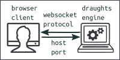
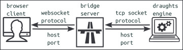

Web2Tcp: bridging Websockets and Tcp Sockets 
--------------------------------------------

This application originated from my problem to make a browser client that acts as a GUI for a draughts engine. The draughts engine is a server process that uses the Tcp Socket protocol.
But there is no simple way to create Tcp Sockets in Javascript on a browser side. Webpages uses the Websocket protocol to communicate with a server. 

My solution is an application called **Web2Tcp** that translates messages from the Websocket protocol to the Tcp Socket protocol and vice versa. I call it a **bridge server** because it acts as a bridge for messages between the Websocket and the Tcp Socket protocol.
Web2Tcp is a server process that runs from the commandline. Written in Python and tested on Linux. I expect it works also for Windows and Mac. It is generally applicable (not only for a draughts engine).
How does it work? 

The bridge server has two parts (see image).
- The left part is a websocket server and communicates with the browser client.  
  The websocket server starts listening to browser clients who want to connect.  
  Once connected it receives and sends messages to the browser client.
- The right part communicates with the draughts engine.  
  It acts as a client which communicates with the draughts engine.  
  If the client is connected to the engine, it exchange messages with the engine. 

The main function of the bridge server is to forward messages. Messages from the browser client are forwarded to the draughts engine. Messages from the draughts engine are forwarded to the browser client.

The internal operation of the bridge server is not very difficult. One thing is important to mention. The Websocket protocol is a message based protocol. The Tcp Socket protocol is stream based. This means we have to define a delimiter for the end of a message. The delimiter we use is the Ascii null-character. 

The application consists of two python files.
You start the bridge server in a terminal with the command:  
**python web2tcp_bridge.py**  
After the prompt you give instructions to setup the bridge server. The main instructions are:
- **connect** **<host>** **<port>**:
  Make a connection with the draughts engine with given host and port.   
  Defaults if host and port are omitted: localhost and 27531.   
  Of course, make sure the draughts engine is started.
- **start** **<host>** **<port>**:
  Start the websocket server with given host and port.   
  Defaults if host and port are omitted: localhost and 27532.

Make sure the portnumbers of both parts of the bridge server are different.
If you add "auto" after the starting command, the connect and start instructions are executed with default host and port values. So it intializes the bridge server for use on a single computer. 

General procedure to make the bridge operational:
1. Terminal command: start the tcp socket server.
2. Terminal command: start the bridge server.
3. Bridge server instruction: make a connection with the tcp socket server.
4. Bridge server instruction: start the websocket server.
5. Browser client instruction: open a connection with the bridge server.

To effectively control the bridge server, two log-files are generated:
- **web2tcp_xsys**: system related messages
- **web2tcp_xmsg**: to view the traffic of messages

For testing purposes two instructions are usefull:
- **chatS** **<msg>**: send a message to the draughts engine server.
- **chatC** **<msg>**: send a message to the browser clients.

For an overview of instructions type **help** after the prompt.

Again the bridge server is generally applicable (not only for a draughts engine). Use it for bridging Websockets and Tcp Sockets.
For future developments it would be better that more engines support the websocket protocol. Then engines can communicate directly with browser clients and therefore a bridge server is not needed.

Links
-----
If you like to setup a client-bridge-server environment, try the following applications.
- [Github MobyDam Draughts engine](https://github.com/rhalbersma/mobydam)
- [Github Draughts webclient]( xxx )
- use **test/ws_client.html**

